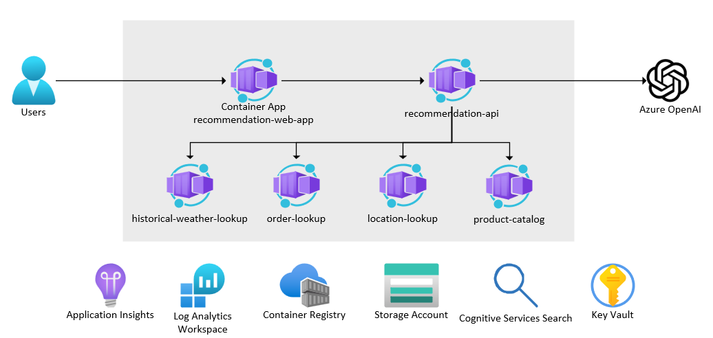

# semantic-kernel-sleeping-bag



This demo app demostrates how to use C# & Semantic Kernel to orchestrate AI calls. In this example, we are building a chatbot for an outdoor sports equipment company. This chatbot needs to be able to answer common questions that customer support gets.

For example, a customer might ask "Will my sleeping bag work for my trip to Patagonia next month?". The chatbot needs to be able to understand the question and then answer it. The answer might be "Yes, your sleeping bag will work for your trip to Patagonia next month. The lowest average temperature in Patagonia in November is 20 degrees Fahrenheiht. Your sleeping bag is rated for 5 degrees Fahrenheit.".

In order to do this, the code needs to be able to call several different data sources to answer the question.

    1.  OrderHistory - This is an API that returns the customer's order history (including the product IDs of the items they ordered).
    1.  ProductCatalog - This is an API that returns the product details for a given product ID.
    1.  LocationLookup - This ia an API that returns the GPS coordindates of a given location.
    1.  HistoricalWeather - This is an API that returns the average temperature for a given GPS location and date.

We need the RecommendationAPI to be able to call all of these APIs and then combine the results into a single answer. Semantic Kernel enables us to orchestrate these API calls via the StepwisePlanner. This planner will make multiple calls to the OpenAI service, make up its own plan to answer the question based upon the data & native plugins it has access to, then execute the plan.

## Disclaimer

**THE SOFTWARE IS PROVIDED "AS IS", WITHOUT WARRANTY OF ANY KIND, EXPRESS OR IMPLIED, INCLUDING BUT NOT LIMITED TO THE WARRANTIES OF MERCHANTABILITY, FITNESS FOR A PARTICULAR PURPOSE AND NONINFRINGEMENT. IN NO EVENT SHALL THE AUTHORS OR COPYRIGHT HOLDERS BE LIABLE FOR ANY CLAIM, DAMAGES OR OTHER LIABILITY, WHETHER IN AN ACTION OF CONTRACT, TORT OR OTHERWISE, ARISING FROM, OUT OF OR IN CONNECTION WITH THE SOFTWARE OR THE USE OR OTHER DEALINGS IN THE SOFTWARE.**

## Prerequisites

- [Azure CLI](https://docs.microsoft.com/en-us/cli/azure/install-azure-cli)
- Azure subscription & resource group
- [Tye](https://github.com/dotnet/tye)
- [.NET 7](https://dotnet.microsoft.com/download/dotnet/7.0)
- [Docker](https://docs.docker.com/get-docker/)
- [Dapr](https://dapr.io/)
- [Node.js with npm](https://nodejs.org/en/)

## Deployment

## Run locally

1.  Set the following application settings to initialize the RecommendationApi (this assumes you already have the required Azure services such as OpenAI & Application Insights deployed)..

    ```shell
    cd src/RecommendationApi

    dotnet user-secrets init

    dotnet user-secrets set "OpenAI:Endpoint" "https://..."

    dotnet user-secrets set "OpenAI:ChatModelName" "chat"

    dotnet user-secrets set "OpenAI:EmbeddingModelName" "embedding"

    dotnet user-secrets set "ApplicationInsights:ConnectionString" ""

    dotnet user-secrets set "EntraID:TenantId" ""

    dotnet user-secrets set "Cors:AllowedOrigins" "http://localhost:3000"
    ```

1.  Run the following command to start the application.

    ```shell
    tye run
    ```

## Deploy to Azure

1.  Run the following command to deploy all services to Azure.

    ```shell
    azd up
    ```

## Links
