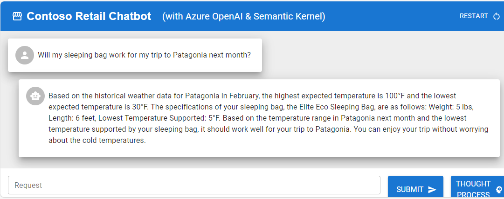

# semantic-kernel-sleeping-bag


This demo app demonstrates how to use C# & Semantic Kernel to orchestrate AI calls. In this example, we are building a chatbot for an outdoor sports equipment company. This chatbot needs to be able to answer common questions that customer support gets.

For example, a customer might ask "Will my sleeping bag work for my trip to Patagonia next month?". The chatbot needs to be able to understand the question and then answer it. The answer might be "Yes, your sleeping bag will work for your trip to Patagonia next month. The lowest average temperature in Patagonia in November is 20 degrees Fahrenheit. Your sleeping bag is rated for 5 degrees Fahrenheit.".

In order to do this, the code needs to be able to call several different data sources to answer the question.

    1.  OrderHistory - This is an API that returns the customer's order history (including the product IDs of the items they ordered).
    1.  ProductCatalog - This is an API that returns the product details for a given product ID.
    1.  LocationLookup - This ia an API that returns the GPS coordindates of a given location.
    1.  HistoricalWeather - This is an API that returns the average temperature for a given GPS location and date.

We need the `RecommendationAPI` to be able to call all of these APIs and then combine the results into a single answer. Semantic Kernel enables us to orchestrate these API calls via the StepwisePlanner. This planner will make multiple calls to the OpenAI service, make up its own plan to answer the question based upon the data & native plugins it has access to, then execute the plan.

Here is a series of blog posts that go through this demo in detail.

- [How to enhance your own chatbot using C# Semantic Kernel & Azure OpenAI that plans & orchestrates its own API calls - part 1](https://jordanbeandev.com/how-to-build-your-own-chatbot-using-c-semantic-kernel-azure-openai-part-1/)
- [How to enhance your own chatbot using C# Semantic Kernel & Azure OpenAI that plans & orchestrates its own API calls - part 2 (demo app implementation)](https://jordanbeandev.com/how-to-build-your-own-chatbot-using-c-semantic-kernel-azure-openai-part-2/)
- [How to enhance your own chatbot using C# Semantic Kernel & Azure OpenAI that plans & orchestrates its own API calls - part 3 (demo app)](https://jordanbeandev.com/how-to-build-your-own-chatbot-using-c-semantic-kernel-azure-openai-part-3-demo-app/)
- [How to enhance your own chatbot using C# Semantic Kernel & Azure OpenAI that plans & orchestrates its own API calls - part 4 (local development & deployment details)](https://jordanbeandev.com/how-to-build-your-own-chatbot-using-c-semantic-kernel-azure-openai-part-4-local-development-deployment-details/)
- [How to dynamically set a runtime config value for a React app in Azure Container Apps](https://jordanbeandev.com/how-to-dynamically-set-a-runtime-config-value-for-a-react-app-in-azure-container-apps/)

## Disclaimer

**THE SOFTWARE IS PROVIDED "AS IS", WITHOUT WARRANTY OF ANY KIND, EXPRESS OR IMPLIED, INCLUDING BUT NOT LIMITED TO THE WARRANTIES OF MERCHANTABILITY, FITNESS FOR A PARTICULAR PURPOSE AND NONINFRINGEMENT. IN NO EVENT SHALL THE AUTHORS OR COPYRIGHT HOLDERS BE LIABLE FOR ANY CLAIM, DAMAGES OR OTHER LIABILITY, WHETHER IN AN ACTION OF CONTRACT, TORT OR OTHERWISE, ARISING FROM, OUT OF OR IN CONNECTION WITH THE SOFTWARE OR THE USE OR OTHER DEALINGS IN THE SOFTWARE.**

## Prerequisites

- [Azure CLI](https://docs.microsoft.com/en-us/cli/azure/install-azure-cli)
- [Azure Developer CLI](https://learn.microsoft.com/en-us/azure/developer/azure-developer-cli/overview)
- Azure subscription & resource group
- [Docker](https://docs.docker.com/get-docker/)

### Local development

- [.NET 8](https://dotnet.microsoft.com/download/dotnet/8.0)
- [Visual Studio 2022 Preview](https://visualstudio.microsoft.com/vs/preview/)
- [.NET Aspire](https://learn.microsoft.com/en-us/dotnet/aspire/get-started/aspire-overview)
  - Visual Studio (https://learn.microsoft.com/en-us/dotnet/aspire/fundamentals/setup-tooling?tabs=visual-studio)
  - CLI (https://learn.microsoft.com/en-us/dotnet/aspire/fundamentals/setup-tooling?tabs=dotnet-cli)
- [Dapr](https://dapr.io/)
- [Node.js with npm](https://nodejs.org/en/)

## Deployment

## Deploy to Azure

1.  Run the following command to deploy all services to Azure (building Docker containers, deploying Azure infrastructure & deploying web apps takes about 30 minutes).

    ```shell
    azd up
    ```

1.  Navigate to the URL specified in the command window (or go to the Web app container app in the Azure portal) and click the `Submit` button.



> [!NOTE]  
> Since this is using generative AI, there is no guarantee that the plan generated will exactly match the screenshots. You may have to run the demo several times to get it to output the desired result.

1.  After getting a response, click on the `Thought Process` button to see a diagram detailing the steps the planner took to answer the question.


## Run locally

1.  Set the following application settings to initialize the `RecommendationApi` (this assumes you already have the required Azure services such as OpenAI & Application Insights deployed). Customize as needed.

    ```shell
    cd src/RecommendationApi

    dotnet user-secrets init

    dotnet user-secrets set "OpenAI:Endpoint" "https://..."

    dotnet user-secrets set "OpenAI:ChatCompletionDeploymentName" "chat"
    
    dotnet user-secrets set "OpenAI:ChatCompletionModelId" "0613"

    dotnet user-secrets set "OpenAI:EmbeddingDeploymentName" "embedding"
 
    dotnet user-secrets set "OpenAI:EmbeddingModelId" "2"
    
    dotnet user-secrets set "OpenAI:ApiKey": ""

    dotnet user-secrets set "ApplicationInsights:ConnectionString" ""

    dotnet user-secrets set "EntraID:TenantId" ""

    dotnet user-secrets set "Cors:AllowedOrigins" "http://localhost:3000"
 
    ```

    >NOTE: The locally running demo defaults to using an API key to authenticate with the Azure OpenAI service. The version that runs in Azure uses a Managed Identity associated with the API Container App & Azure RBAC (`Cognitive Services OpenAI User` role) to authenticate with the Azure OpenAI service.`) 

1.  Run the following command to start the application.

    ```shell
    cd ..   
 
    dotnet run --project .\semantic-kernel-sleeping-bag.AppHost\semantic-kernel-sleeping-bag.AppHost.csproj
    ```

1.  Navigate to the following URLs to test the application.
    
    - [Web App](http://localhost:3000)
    - [Aspire dashboard (status of services)](http://localhost:15293) (NOTE: your port may be different, check the command window to be sure)
    - [Zipkin dashboard (view traces)](http://localhost:9411/zipkin)

## Links

- [Semantic Kernel](https://learn.microsoft.com/en-us/semantic-kernel/overview/)
- [Stepwise Planner](https://learn.microsoft.com/en-us/semantic-kernel/ai-orchestration/planners/?tabs=Csharp)
- [Azure OpenAI](https://learn.microsoft.com/en-us/azure/ai-services/openai/overview)
- [Azure Container Apps](https://learn.microsoft.com/en-us/azure/container-apps/overview)
- [Azure Developer CLI](https://learn.microsoft.com/en-us/azure/developer/azure-developer-cli/overview)
- [Aspire](https://learn.microsoft.com/en-us/dotnet/aspire/get-started/aspire-overview)
- [Dapr](https://dapr.io/)
